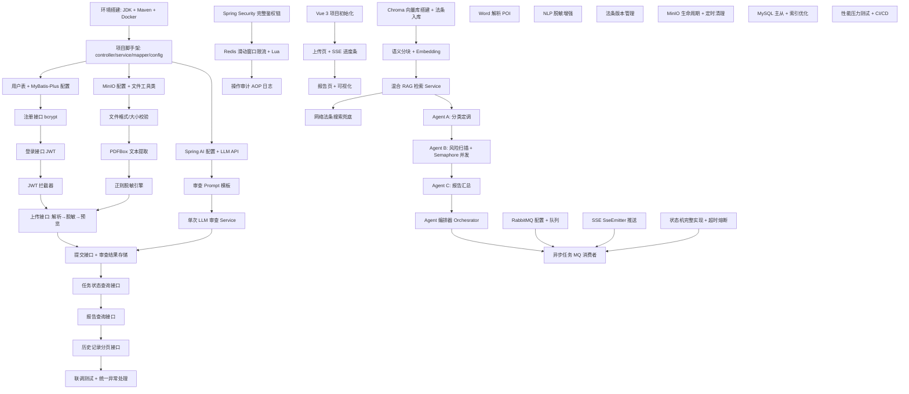

# Implementation Plan

## Overview

### 目标

基于 [需求分析文档](requirements.md) 和 [设计文档](design.md)，将「基于 Multi-Agent 与 RAG 的智能合同风险审查系统」分 4 个阶段（Phase 0-3）逐步落地，从环境搭建到完整架构交付。

### 范围

覆盖后端核心链路（用户鉴权、文件上传解析、隐私脱敏、LLM 审查、RAG 检索、Multi-Agent 编排、异步任务与 SSE、报告生成）及前端展示层。

### 关键约束

- 技术栈：Spring Boot 3 + MyBatis-Plus + Spring AI + MySQL + Redis + RabbitMQ + Chroma + MinIO
- 前端：Vue 3 + Element Plus + Axios
- Phase 1 为 MVP 阶段，优先跑通上传 → 脱敏 → LLM 审查 → 报告全链路
- Phase 2/3 逐步引入 MQ、SSE、RAG、Multi-Agent 等进阶能力

---

## Task Dependency Graph



#### Wave 定义

```json
{
  "waves": [
    {
      "wave": 0,
      "name": "环境搭建",
      "duration": "1-2d",
      "tasks": ["T0.1", "T0.2", "T0.3", "T0.4"],
      "dependencies": [],
      "milestone": "M0 — 开发环境就绪，项目可启动",
      "parallelGroups": [
        ["T0.1", "T0.2"],
        ["T0.3", "T0.4"]
      ]
    },
    {
      "wave": 1,
      "name": "MVP 核心链路",
      "duration": "10-15d",
      "tasks": [
        "T1.1", "T1.2", "T1.3", "T1.4",
        "T1.5", "T1.6", "T1.7", "T1.8",
        "T1.9", "T1.10",
        "T1.11", "T1.12", "T1.13", "T1.14",
        "T1.15", "T1.16", "T1.17", "T1.18",
        "T1.19", "T1.20", "T1.21",
        "T1.22", "T1.23", "T1.24", "T1.25"
      ],
      "dependencies": ["wave:0"],
      "milestone": "M1 — MVP 全链路可运行",
      "subWaves": [
        {
          "name": "用户模块",
          "order": 1,
          "tasks": ["T1.1", "T1.2", "T1.3", "T1.4"]
        },
        {
          "name": "文件上传与解析",
          "order": 2,
          "tasks": ["T1.5", "T1.6", "T1.7", "T1.8"]
        },
        {
          "name": "隐私脱敏",
          "order": 3,
          "tasks": ["T1.9", "T1.10"]
        },
        {
          "name": "LLM 审查",
          "order": 4,
          "tasks": ["T1.11", "T1.12", "T1.13", "T1.14"]
        },
        {
          "name": "查询与报告",
          "order": 5,
          "tasks": ["T1.15", "T1.16", "T1.17", "T1.18"]
        },
        {
          "name": "异步化与状态机",
          "order": 6,
          "tasks": ["T1.19", "T1.20", "T1.21"]
        },
        {
          "name": "联调完善",
          "order": 7,
          "tasks": ["T1.22", "T1.23", "T1.24", "T1.25"]
        }
      ]
    },
    {
      "wave": 2,
      "name": "功能增强",
      "duration": "8-12d",
      "tasks": [
        "T2.1", "T2.2", "T2.3", "T2.4",
        "T2.5", "T2.6", "T2.7", "T2.8",
        "T2.9", "T2.10", "T2.11", "T2.12", "T2.13", "T2.14"
      ],
      "dependencies": ["wave:1"],
      "milestone": "M2 — 具备完整 RAG + Multi-Agent + 异步 SSE 能力",
      "parallelGroups": [
        ["T2.1", "T2.2", "T2.3", "T2.4"],
        ["T2.9", "T2.10"]
      ]
    },
    {
      "wave": 3,
      "name": "架构完善",
      "duration": "8-12d",
      "tasks": [
        "T3.1", "T3.2", "T3.3", "T3.4",
        "T3.5", "T3.6", "T3.7", "T3.8", "T3.9", "T3.10",
        "T3.11", "T3.12", "T3.13", "T3.14", "T3.15",
        "T3.16", "T3.17", "T3.18"
      ],
      "dependencies": ["wave:2"],
      "milestone": "M3 — 系统完整交付，生产就绪",
      "parallelGroups": [
        ["T3.1", "T3.2", "T3.3", "T3.4"],
        ["T3.5", "T3.6", "T3.7", "T3.8", "T3.9", "T3.10"],
        ["T3.11", "T3.12", "T3.13", "T3.14", "T3.15"],
        ["T3.16", "T3.17", "T3.18"]
      ]
    }
  ],
  "criticalPath": [
    "T0.1", "T0.3", "T1.1", "T1.2", "T1.3", "T1.4",
    "T1.9", "T1.10",
    "T1.11", "T1.12", "T1.13", "T1.14",
    "T1.15", "T1.16", "T1.17",
    "T1.19", "T1.20",
    "T2.1", "T2.2", "T2.3",
    "T2.5", "T2.6", "T2.7", "T2.8",
    "T2.9", "T2.11", "T2.12",
    "T3.1", "T3.2", "T3.3",
    "T3.5", "T3.6", "T3.7", "T3.8", "T3.9"
  ],
  "totalEstimatedDuration": "27-41d"
}
```

## Tasks

### Phase 0：环境搭建（1-2 天）

| ID | 任务 | 预估工时 | 前置依赖 | 产出 |
|----|------|----------|----------|------|
| T0.1 | JDK 17 + IDEA + Maven 项目脚手架搭建 | 0.5d | — | Spring Boot 3 空项目可运行 |
| T0.2 | Docker 启动 MySQL 8.0 + Redis + MinIO | 0.5d | — | 中间件容器正常运行 |
| T0.3 | 项目基础结构：controller/service/mapper/config 包划分 | 0.5d | T0.1 | 项目骨架就绪 |
| T0.4 | application.yml 配置多环境（dev/prod）+ 依赖引入 | 0.5d | T0.2 | 配置中心就绪 |

**里程碑：M0 — 开发环境就绪，项目可启动**

---

### Phase 1：MVP 核心链路（10-15 天）

#### 1.1 用户模块（第 2-3 天）

| ID | 任务 | 预估工时 | 前置依赖 | 产出 |
|----|------|----------|----------|------|
| T1.1 | user 表建表 + MyBatis-Plus 配置 + UserMapper | 0.5d | T0.4 | CRUD 可运行 |
| T1.2 | 注册接口（密码 BCrypt 加密存储） | 0.5d | T1.1 | `POST /register` 可用 |
| T1.3 | 登录接口（JWT 签发，JJWT 库） | 0.5d | T1.2 | `POST /login` 返回 token |
| T1.4 | JWT HandlerInterceptor 拦截器（校验 Token） | 0.5d | T1.3 | 受保护接口需携带 Token |

#### 1.2 文件上传与解析模块（第 4-5 天）

| ID | 任务 | 预估工时 | 前置依赖 | 产出 |
|----|------|----------|----------|------|
| T1.5 | MinIO 配置 + 文件上传工具类 | 0.5d | T0.2 | 文件可上传至 MinIO |
| T1.6 | 文件格式校验（仅 PDF/Word，≤ 20MB） | 0.25d | T1.5 | 非法格式返回 1001/1002 |
| T1.7 | PDFBox 提取 PDF 文本 + review_task 表建表 | 1d | T1.6 | PDF 文本提取 + 任务记录持久化 |
| T1.8 | 上传接口：解析 → 可选脱敏（根据 desensitize 参数）→ 存储 → 返回 previewText + taskId | 0.5d | T1.7, T1.4, T1.10 | `POST /upload` 全流程可用 |

#### 1.3 隐私脱敏模块（第 6 天）

| ID | 任务 | 预估工时 | 前置依赖 | 产出 |
|----|------|----------|----------|------|
| T1.9 | 正则脱敏引擎（姓名/身份证/手机号/银行卡号 4 类） | 1d | — | 敏感信息替换为 `***` |
| T1.10 | 脱敏引擎集成到上传流程（支持通过 `desensitize` 参数控制是否脱敏，默认脱敏） | 0.5d | T1.9 | 上传接口根据 desensitize 参数输出已脱敏或原始预览文本 |

#### 1.4 LLM 审查模块（第 7-8 天）

| ID | 任务 | 预估工时 | 前置依赖 | 产出 |
|----|------|----------|----------|------|
| T1.11 | Spring AI 依赖引入 + LLM API Key 配置（OpenAI / 通义千问） | 0.5d | T0.4 | ChatClient 可调用 |
| T1.12 | 审查 Prompt 模板设计 | 0.5d | T1.11 | Prompt 输出结构化 JSON |
| T1.13 | 单次 LLM 审查 Service（同步调用，全文送入） | 1d | T1.12 | 调用 LLM 返回审查结果 |
| T1.14 | 审查结果 JSON 解析 + 存储到 risk_item / review_report 表 | 0.5d | T1.13 | 风险项和报告持久化 |

#### 1.5 查询与报告（第 9-10 天）

| ID | 任务 | 预估工时 | 前置依赖 | 产出 |
|----|------|----------|----------|------|
| T1.15 | 任务状态查询接口 `GET /status` | 0.5d | T1.14 | 返回 taskId + status + progress |
| T1.16 | 审查报告查询接口 `GET /report` | 0.5d | T1.14 | 返回结构化报告 JSON |
| T1.17 | 历史记录分页查询 `GET /history` | 0.5d | T1.14 | 降序分页返回任务列表 |
| T1.18 | 接口联调测试（Apifox / Postman） | 0.5d | T1.15-1.17 | 全流程接口验证通过 |

#### 1.6 异步化与状态机（第 11-12 天）

| ID | 任务 | 预估工时 | 前置依赖 | 产出 |
|----|------|----------|----------|------|
| T1.19 | `@Async` 异步执行审查任务 | 0.5d | T1.13 | 提交后立即返回，审查异步执行 |
| T1.20 | 简化状态机：PENDING → PROCESSING → SUCCESS / FAILED | 0.5d | T1.19 | 状态正确流转 |
| T1.21 | 前端轮询 `GET /status` 获取进度 | 0.5d | T1.20 | 前端可轮询显示进度 |

#### 1.7 联调完善（第 13-15 天）

| ID | 任务 | 预估工时 | 前置依赖 | 产出 |
|----|------|----------|----------|------|
| T1.22 | 全局异常处理 + 统一响应格式 + 业务错误码 | 0.5d | — | 错误返回统一 JSON |
| T1.23 | LLM 调用失败 / 解析失败等异常处理 | 0.5d | T1.22 | 异常场景不崩溃 |
| T1.24 | 全链路集成测试 | 1d | T1.1-1.23 | 注册→登录→上传→提交→报告全流程通过 |
| T1.25 | 代码整理 + 单元测试补全 + README | 1d | T1.24 | 代码规范、覆盖率 ≥ 60% |

**里程碑：M1 — MVP 全链路可运行，上传→脱敏→LLM 审查→报告可演示**

---

### Phase 2：功能增强（8-12 天）

#### 2.1 RAG 法条检索

| ID | 任务 | 预估工时 | 前置依赖 | 产出 |
|----|------|----------|----------|------|
| T2.1 | Docker 启动 Chroma + 法条文本向量化入库 | 1d | T0.2 | Chroma 包含《民法典》《劳动合同法》等向量 |
| T2.2 | 语义分块 Chunking 工具类 | 0.5d | — | 按条款/段落分块，保留上下文 |
| T2.3 | Embedding → Chroma 余弦检索 Service（阈值 0.75 可配置） | 1d | T2.1, T2.2 | 给定 Chunk 返回最相关法条 |
| T2.4 | 网络法条搜索兜底（flk.npc.gov.cn HTML 解析，缓存 TTL 7d） | 1d | T2.3 | 本地未命中时网络搜索兜底 |

#### 2.2 Multi-Agent 编排

| ID | 任务 | 预估工时 | 前置依赖 | 产出 |
|----|------|----------|----------|------|
| T2.5 | Agent A：合同分类与定调 Prompt + 调用 | 0.5d | T1.11 | 输出 contractType + userStance |
| T2.6 | Agent B：逐条风险扫描 Prompt + Semaphore(10) 并发控制 | 1d | T2.5, T2.3 | 每条输出风险点 |
| T2.7 | Agent C：汇总报告 Prompt | 0.5d | T2.6 | 输出汇总报告 |
| T2.8 | Agent 编排器：A → 分块 → RAG → B(并发) → C | 1d | T2.5-2.7 | 全自动编排流转 |

#### 2.3 异步任务与 SSE

| ID | 任务 | 预估工时 | 前置依赖 | 产出 |
|----|------|----------|----------|------|
| T2.9 | RabbitMQ 安装 + 队列配置 + DLX 死信队列 | 1d | T0.2 | MQ 可投递和消费 |
| T2.10 | SSE 推送服务（ConcurrentHashMap + SseEmitter） | 1d | — | 各阶段进度实时推送 |
| T2.11 | 完整状态机实现（PENDING → PARSING → RETRIEVING → REVIEWING → SUMMARIZING → SUCCESS / FAILED） | 1d | T2.9 | 状态严格按矩阵流转 |
| T2.12 | MQ 消费者：接收消息 → 状态机驱动 → SSE 推送 | 1.5d | T2.9, T2.10, T2.11 | 异步全链路打通 |
| T2.13 | 超时熔断（各阶段超时阈值）+ 指数退避重试 3 次 | 0.5d | T2.12 | 超时自动熔断，重试可控 |
| T2.14 | 用户手动重试 `POST /retry` | 0.5d | T2.12 | FAILED 任务可重新排队 |

**里程碑：M2 — 具备完整 RAG + Multi-Agent + 异步 SSE 能力**

---

### Phase 3：架构完善（8-12 天）

#### 3.1 安全加固

| ID | 任务 | 预估工时 | 前置依赖 | 产出 |
|----|------|----------|----------|------|
| T3.1 | Spring Security 完整鉴权链（SecurityFilterChain 配置） | 1.5d | T1.4 | 正式安全框架接入 |
| T3.2 | Token 刷新机制（Refresh Token 30d Redis 存储） | 0.5d | T3.1 | `POST /refresh` 接口 |
| T3.3 | Redis 滑动窗口限流 + Lua 原子配额扣减脚本 | 1d | T1.1, T0.2 | 超限返回 1008/1003 |
| T3.4 | 操作审计 AOP 切面（operation_log 表） | 0.5d | T3.1 | 关键操作结构化日志 |

#### 3.2 前端开发

| ID | 任务 | 预估工时 | 前置依赖 | 产出 |
|----|------|----------|----------|------|
| T3.5 | Vue 3 + Element Plus 项目初始化 + Axios 配置 | 0.5d | — | 前端项目可运行 |
| T3.6 | 注册 / 登录页面 | 1d | T3.5 | 用户可注册登录 |
| T3.7 | 文件上传页面（拖拽上传 + 脱敏预览确认） | 1d | T3.6 | 上传 → 预览 → 确认提交流程 |
| T3.8 | SSE 进度条组件 + 任务状态展示 | 1d | T3.7 | 实时进度可视化 |
| T3.9 | 审查报告页面（风险分类、等级标签、修改建议） | 1.5d | T3.8 | 报告结构化展示 |
| T3.10 | 历史记录页面（分页列表） | 0.5d | T3.9 | 历史任务可回溯 |

#### 3.3 功能完善与运维

| ID | 任务 | 预估工时 | 前置依赖 | 产出 |
|----|------|----------|----------|------|
| T3.11 | Word 解析（Apache POI 支持 .doc/.docx） | 1d | T1.7 | 支持 Word 上传（P1） |
| T3.12 | NLP 脱敏增强（引入 HanLP / LLM 辅助 NER） | 1.5d | T1.9 | 脱敏准确率提升 |
| T3.13 | 法条版本管理 + 入库脚本 | 1d | T2.1 | 法条可追溯版本 |
| T3.14 | MinIO 生命周期管理 + 临时文件定时清理 | 0.5d | T1.5 | 1h PENDING / 24h preview_text 清理 |
| T3.15 | MySQL 索引优化 + 主从备份配置 | 0.5d | — | 查询性能优化 |
| T3.16 | JMeter 压力测试 + 性能基线 | 1d | T3.15 | 报告：并发/吞吐/响应时间 |
| T3.17 | 代码质量检查 + JaCoCo 覆盖率 ≥ 80% | 1d | — | 质量门禁通过 |
| T3.18 | CI/CD 流水线配置（GitHub Actions / GitLab CI） | 0.5d | — | 自动构建 + 测试 |

**里程碑：M3 — 系统完整交付，生产就绪**

---

## Notes

### 已知风险

| 风险 | 影响 | 缓解措施 |
|------|------|----------|
| LLM API 调用超时 / 不稳定 | 审查任务失败 | 指数退避重试 3 次 + DLX 死信队列兜底；支持切换多供应商 |
| Chroma 向量库首次构建耗时 | 延迟 Phase 2 启动 | Phase 1 提前准备法条数据 + 入库脚本 |
| 脱敏正则误匹配 | 用户隐私泄露风险 | P0 正则 + P1 NLP 增强渐进；验收标准要求 ≥ 90% 命中率 |
| 大合同（> 50 页）审查超阈值 | 总耗时 > 5min 触发熔断 | Map-Reduce 分片处理，超时熔断后支持手动重试 |

### 假设条件

- **Phase 1** 不实现前端，纯后端接口通过 Apifox / Postman 测试
- **Phase 1** 不引入 RabbitMQ，使用 `@Async` + `CompletableFuture` 简化异步
- **Phase 1** 不实现 SSE，前端轮询 `GET /status`
- LLM API Key 由开发者自行配置（OpenAI / 通义千问均可）
- 所有中间件（MySQL / Redis / MinIO / Chroma / RabbitMQ）通过 Docker 本地部署

### 关键依赖资源

| 资源 | 用途 | 获取方式 |
|------|------|----------|
| OpenAI API Key 或 通义千问 API Key | LLM 调用 | 官方申请 |
| 权威法律法规文本（《民法典》《劳动合同法》等） | 法条向量化入库 | 国家法律法规数据库 flk.npc.gov.cn |
| Docker Desktop | 本地中间件部署 | 官网下载 |
| JDK 17 + Maven | 后端开发 | 官网下载 |

### 实施顺序建议

1. **严格按 Phase 0 → Phase 1 → Phase 2 → Phase 3 顺序执行**，每个 Phase 内部的任务按 ID 顺序
2. Phase 2 和 Phase 3 中部分无依赖的任务可并行（如 T3.11 Word 解析与 T3.5 前端初始化无依赖关系）
3. 每个 Phase 结束时建议做一次**集成验证**，确保里程碑达标后再进入下一 Phase
